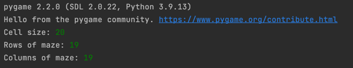

# Maze Solver
Search Algorithm (DFS, BFS, A*)  
MDP (Value Iteration, Policy Iteration)  
### Instructions to run the program
* Make sure under the root directory of the project
* Run the main.py file
* Enter the required parameters in the command line (Cell size of maze, rows and columns)

* Press enter, the program will run. The generated maze and solutions using different algorithms will be shown in Pygame window.
### Link to watch the demo video
https://drive.google.com/drive/folders/14y5orH0ZdTrwCfx7LyaXybC76UqVQt6X?usp=share_link